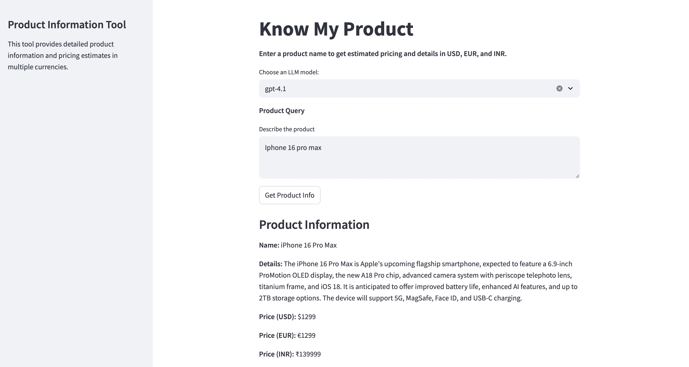

# know-my-product🛍️📦  – Type a Product, Get Smart Info – It's That Easy

**know-my-product** is a lightweight AI-powered application that delivers concise product summaries and real-time estimated prices in Indian Rupees (INR). Powered by cutting-edge Large Language Models (LLMs) like **GPT-4.1**, **Qwen**, **gemma** and **LLaMA 3**, it’s perfect for quick product research, comparison, and market value estimation.

Built with **LangChain**, **Streamlit**, and integrations with **OpenAI** and **Groq**, ItemInsight offers a seamless experience with clean UI and structured output.


---

## 📌 Features

- ✅ Accepts free-text product name input
- 🧠 Utilizes top-tier LLMs (GPT-4.1, Qwen QWQ, LLaMA 3.3)
- ⚙️ Clean Streamlit UI for interactive exploration
- 📦 Returns structured JSON response with:
  - **Product Name**
  - **Short Description** (≤150 words)
  - **Estimated Price** in:
    - USD ($)
    - EUR (€)
    - INR (₹)
- 🔄 Multi-LLM toggle: switch easily between models
- 🔐 Secure API key usage via `.env` file
- 🌐 Ready for LLM observability via LangChain Tracing

---

## 🖼️ Sample Output

```json
{
  "product_name": "Apple AirPods Max 2",
  "product_details": "The Apple AirPods Max 2 are the anticipated second-generation over-ear wireless headphones from Apple, expected to feature improved active noise cancellation, enhanced audio quality, longer battery life, and updated H-series chip for better connectivity and performance. They retain the premium build with aluminum ear cups, memory foam cushions, and digital crown controls. Expected upgrades include new color options, enhanced transparency mode, and support for lossless audio.",
  "product_price_usd": 549,
  "product_price_eur": 599,
  "product_price_inr": 59900
}
